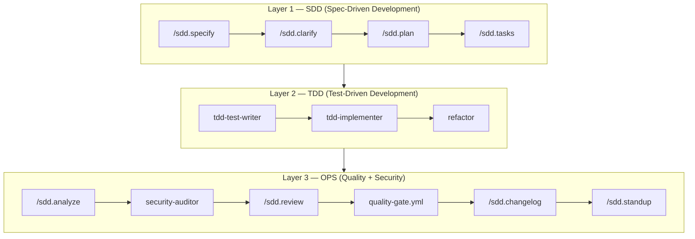

# ai-first-pipeline

[](https://github.com/jonatascatarina/ai-first-pipeline/releases/tag/v4.5.0) [](https://opensource.org/licenses/MIT) [](https://github.com/jonatascatarina/ai-first-pipeline/commits/main) [](https://github.com/jonatascatarina/ai-first-pipeline/stargazers) [🇧🇷 Leia em português](./README.pt-BR.md)

Lightweight SDD pipeline for AI coding agents.  
Zero runtime dependencies, agent-agnostic, Markdown-only.

---

## What is this?

A ready-to-use template that structures how you and your AI agent develop software together — from the first idea to the changelog. Instead of going straight to code, you define a spec, clarify ambiguities, build a plan, and let the agent implement task by task. All artifacts are plain Markdown files, versioned alongside your code.

---

## Quickstart

**Prerequisites:** [Git](https://git-scm.com), [GitHub CLI](https://cli.github.com) (`gh auth login`), and [Claude Code](https://claude.ai/code).

1. **Create your project from this template**

```bash
gh repo create my-project \
  --template jonatascatarina/ai-first-pipeline \
  --public \
  --clone
cd my-project
```

2. **Open with your AI agent**

```bash
claude
```

3. **Tell it what you want to build**

The agent asks a few questions and handles the rest — spec, plan, and tasks — then shows you what to do next.

> If the agent doesn't start automatically, run `/sdd.start`.

---

## Choose Your Path

### Quick path — small or trivial features

Run a single command that specifies, plans, and creates tasks in one shot:

```
/sdd.lite
```

Output: `specs/<FEATURE-NNN>/lite.md` with outcomes, up to 3 tasks, and overall risk. No clarify step, no separate analysis.

---

### Full path — larger features

Follow the 13-step pipeline across three layers. Start here:

**1. Set up your project (once per project)**

```
/sdd.constitution
```

Defines your project's principles, stack and governance rules. Saves to `constitution.md`. Run once; update when the contract changes.

**2. Write the feature spec**

```
/sdd.specify
```

Describe the feature in plain language. The agent produces `specs/<FEATURE-NNN>/spec.md` with actors, acceptance criteria, and an explicit out-of-scope section.

**3. Clarify, plan and break into tasks**

```
/sdd.clarify
```
The agent reads the spec and asks the questions that would block planning. Answer them.

```
/sdd.plan
```
Generates `specs/<FEATURE-NNN>/plan.md` with the implementation approach, risks and dependencies.

```
/sdd.tasks
```
Breaks the plan into self-contained executable tasks in `specs/<FEATURE-NNN>/tasks.md`.

**4. Implement task by task**

Each task in `tasks.md` is a self-contained unit of work with a clear completion criterion. To run a task, ask your agent:

```
Read specs/FEATURE-NNN/tasks.md and execute task T1.
```

Or activate the specialized agents from Layer 2 (see below).

**5. Review and ship**

```
/sdd.analyze    → conformance report: spec vs. code
/sdd.review     → spec-guided code review (interactive)
/sdd.drift      → detect divergence between spec and implementation
/sdd.changelog  → generate changelog section from git log
/sdd.standup    → generate a standup summary for the team
```

---

## Pipeline



### Layer 1 — SDD

| Step | Command | Model | Output |
|------|---------|-------|--------|
| 1. Specify | `/sdd.specify` | Sonnet | `specs/<ID>/spec.md` |
| 2. Clarify | `/sdd.clarify` | Sonnet | `specs/<ID>/perguntas-respondidas.md` |
| 3. Plan | `/sdd.plan` | Sonnet | `specs/<ID>/plan.md` |
| 4. Tasks | `/sdd.tasks` | Haiku | `specs/<ID>/tasks.md` |

### Layer 2 — TDD

Activate each agent by asking your agent to read its definition file and the current feature spec:

```
Read .claude/agents/tdd-test-writer.md and specs/FEATURE-NNN/spec.md, then execute.
```

| Step | Agent file | Output |
|------|-----------|--------|
| 5. Write tests | `.claude/agents/tdd-test-writer.md` | Test suite based on acceptance criteria |
| 6. Implement | `.claude/agents/tdd-implementer.md` | Minimal code to make tests pass |
| 7. Refactor | `.claude/agents/refactor.md` | Clean code, tests still green |

### Layer 3 — OPS

| Step | Command / Agent | Output |
|------|----------------|--------|
| 8. Analyze | `/sdd.analyze` | `specs/<ID>/analysis-report.md` |
| 9. Security audit | `.claude/agents/security-auditor.md` | Report with BLOCKERs |
| 10. Review | `/sdd.review` | PR review comment (copy-paste ready) |
| 11. Quality gate | `.github/workflows/quality-gate.yml` | lint → test → sec-scan → build |
| 12. Changelog | `/sdd.changelog` | Updated `CHANGELOG.md` |
| 13. Standup | `/sdd.standup` | Team standup summary |

See `docs/tdd-ops-guide.md` for the complete activation guide for Layers 2 and 3.

---

## All Commands

### Spec and planning

| Command | When to use |
|---------|------------|
| `/sdd.start` | Entry point — detects project state and guides you through what's next |
| `/sdd.constitution` | Once per project — define principles, stack, governance |
| `/sdd.specify` | Start of every new feature |
| `/sdd.clarify` | After specify — resolve ambiguities before planning |
| `/sdd.plan` | After clarify — implementation approach and risks |
| `/sdd.tasks` | After plan — executable task breakdown |
| `/sdd.lite` | Small or trivial features — spec + plan + tasks in one run |
| `/sdd.epic` | Large initiative — decompose into features with dependency map |

### Quality and review

| Command | When to use |
|---------|------------|
| `/sdd.analyze` | After implementation — conformance report |
| `/sdd.drift` | Anytime — detect spec vs. implementation divergence |
| `/sdd.review` | Before merging — spec-guided code review |
| `/sdd.changelog` | Before releasing — generate changelog from git log |
| `/sdd.standup` | Daily — generate standup summary |
| `/pr-checklist` | Before reviewing a PR — generate review checklist |

### Architecture and integrations

| Command | When to use |
|---------|------------|
| `/sdd.adr` | When making an architectural decision — create an ADR |
| `/sdd.issue` | Publish specs as GitHub Issues or convert Issues into spec scaffolds |

---

## Structure

```
ai-first-pipeline/
├── README.md               ← you are here (English)
├── README.pt-BR.md         ← Portuguese version
├── constitution.md         ← project principles and governance rules
├── CLAUDE.md               ← agent instructions and model routing
├── AGENTS.md               ← agent definitions
├── CONTRIBUTING.md         ← how to contribute
├── CHANGELOG.md            ← version history
├── .claude/
│   ├── commands/           ← /sdd.* commands (Markdown prompts)
│   ├── agents/             ← TDD, refactor, security-auditor, onboarding agents
│   └── hooks/              ← pre-tool-use: file protection rules
├── .github/
│   ├── ISSUE_TEMPLATE/     ← structured Issue template for features
│   └── workflows/
│       └── quality-gate.yml ← CI pipeline template (configure before activating)
├── docs/
│   ├── adr/                ← Architecture Decision Records
│   └── tdd-ops-guide.md    ← TDD and OPS layers activation guide
└── specs/                  ← feature specs and epics
    ├── EXAMPLE-001/        ← example: rate limiting (sliding window + Redis)
    └── EXAMPLE-002/        ← example: OAuth2 with GitHub (PKCE)
```

---

## What's in `specs/`

**Didactic examples (`EXAMPLE-*`)** — complete specs for real-world scenarios, demonstrating expected format and depth. Use as reference. Safe to delete when starting a real project.

- `EXAMPLE-001/` — per-user rate limiting (REST API, sliding window, Redis)
- `EXAMPLE-002/` — OAuth2 authentication with GitHub (Authorization Code Flow + PKCE)

**Pipeline's own specs (`FEATURE-*`)** — this project was built using the process it documents. Specs `FEATURE-002` to `FEATURE-008` record how each command was specified, planned and implemented. Real development history — and additional examples of the pipeline in action.

---

## Comparison

| Feature | ai-first-pipeline | Spec Kit | Kiro |
|---------|-------------------|----------|------|
| Zero dependencies | ✅ Markdown only | ❌ Python CLI | ❌ Full IDE |
| Agent-agnostic | ✅ | ✅ | ❌ Locked |
| Drift detection | ✅ `/sdd.drift` | ❌ | ❌ |
| Lite mode | ✅ `/sdd.lite` | ❌ | ❌ |
| Event hooks | ❌ | ❌ | ✅ |
| Bilingual docs | ✅ EN + PT-BR | ❌ EN only | ❌ EN only |

---

## Principles

- **Spec before code** — no production code without an approved spec
- **Questions before assumptions** — clarifying is cheaper than refactoring
- **Docs as source of truth** — Markdown versions decisions, code implements them
- **AI-native** — every phase is designed to be executed by an agent

See `constitution.md` for the full project contract.
