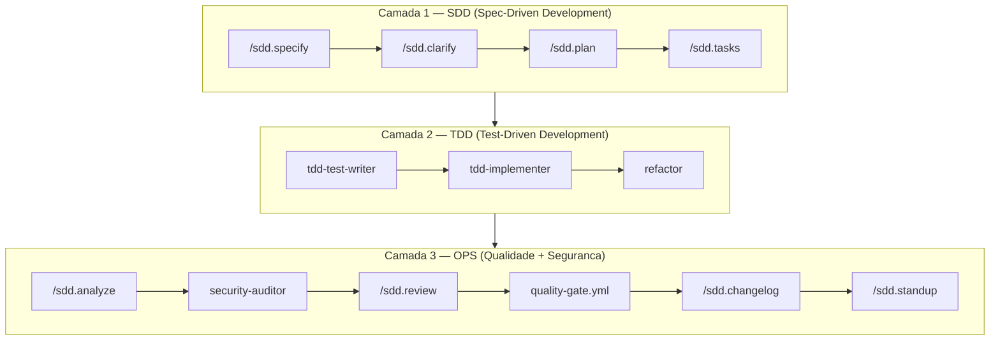

# ai-first-pipeline

[](https://github.com/jonatascatarina/ai-first-pipeline/releases/tag/v4.5.0) [](https://opensource.org/licenses/MIT) [](https://github.com/jonatascatarina/ai-first-pipeline/commits/main) [](https://github.com/jonatascatarina/ai-first-pipeline/stargazers) [🇺🇸 Read in English](./README.md)

Template de pipeline AI-first para desenvolvimento de software com SDD (Spec-Driven Development), TDD e DevSecOps integrados.  
Zero dependencias de runtime. Apenas Markdown versionado.

---

## O que e isso?

Um template pronto para estruturar como voce e seu agente de IA desenvolvem software juntos — da primeira ideia ao changelog. Em vez de ir direto ao codigo, voce define uma spec, clarifica as ambiguidades, gera um plano e deixa o agente implementar task por task. Todos os artefatos sao arquivos Markdown simples, versionados junto com o codigo.

---

## Quickstart

### Prerequisitos
- [Git](https://git-scm.com) instalado
- [GitHub CLI](https://cli.github.com) instalado e autenticado (`gh auth login`)
- Um agente de IA: [Claude Code](https://claude.ai/code), Cursor ou Copilot

### 1. Crie seu projeto a partir deste template

```bash
gh repo create meu-projeto --template jonatascatarina/ai-first-pipeline --public --clone
cd meu-projeto
```

> Cria um repositorio publico no GitHub com toda a estrutura do pipeline e clona localmente.  
> Para criar um repositorio privado, substitua `--public` por `--private`.

### 2. Abra o projeto com seu agente de IA

```bash
# Claude Code
claude

# Ou abra no Cursor / Copilot pelo seu editor
```

### 3. Defina a constituicao do projeto

```
/sdd.constitution
```

> O agente le `constitution.md` e define os principios imutaveis do seu projeto.

### 4. Escreva a spec da sua primeira feature

**Feature pequena ou trivial** — spec, plano e tasks em uma unica execucao:

```
/sdd.lite
```

**Feature maior** — inicie o pipeline completo de 13 passos:

```
/sdd.specify
```

> Veja **[Escolha o seu caminho](#escolha-o-seu-caminho)** abaixo para o guia completo do pipeline.

---

## Escolha o seu caminho

### Caminho rapido — features pequenas ou triviais

Execute um unico comando que especifica, planeja e cria as tasks de uma vez:

```
/sdd.lite
```

Saida: `specs/<FEATURE-NNN>/lite.md` com outcomes, ate 3 tasks e risco geral. Sem etapa de clarificacao, sem analise separada.

---

### Caminho completo — features maiores

Siga o pipeline de 13 passos em tres camadas. Comece aqui:

**1. Configure seu projeto (uma vez por projeto)**

```
/sdd.constitution
```

Define os principios, stack e regras de governanca do projeto. Salvo em `constitution.md`. Execute uma vez; atualize quando o contrato mudar.

**2. Escreva a spec da feature**

```
/sdd.specify
```

Descreva a feature em linguagem natural. O agente produz `specs/<FEATURE-NNN>/spec.md` com atores, criterios de aceite e uma secao explicita de nao-escopo.

**3. Clarifique, planeje e decomponha em tasks**

```
/sdd.clarify
```
O agente le a spec e faz as perguntas que bloqueariam o planejamento. Responda-as.

```
/sdd.plan
```
Gera `specs/<FEATURE-NNN>/plan.md` com a abordagem de implementacao, riscos e dependencias.

```
/sdd.tasks
```
Decompoe o plano em tasks autonomas e executaveis em `specs/<FEATURE-NNN>/tasks.md`.

**4. Implemente task por task**

Cada task em `tasks.md` e uma unidade de trabalho autonoma com criterio de conclusao claro. Para executar uma task, peca ao seu agente:

```
Leia specs/FEATURE-NNN/tasks.md e execute a task T1.
```

Ou ative os agentes especializados da Camada 2 (veja abaixo).

**5. Revise e publique**

```
/sdd.analyze    → relatorio de conformidade: spec vs. codigo
/sdd.review     → revisao de codigo guiada por spec (interativa)
/sdd.drift      → detecta divergencia entre spec e implementacao
/sdd.changelog  → gera secao de changelog a partir do git log
/sdd.standup    → gera resumo de standup para o time
```

---

## Pipeline



### Camada 1 — SDD

| Passo | Comando | Agente | Saida |
|-------|---------|--------|-------|
| 1. Especificar | `/sdd.specify` | Sonnet | `specs/<ID>/spec.md` |
| 2. Clarificar | `/sdd.clarify` | Sonnet | `specs/<ID>/perguntas-respondidas.md` |
| 3. Planejar | `/sdd.plan` | Sonnet | `specs/<ID>/plan.md` |
| 4. Detalhar tasks | `/sdd.tasks` | Haiku | `specs/<ID>/tasks.md` |

### Camada 2 — TDD

Ative cada agente pedindo ao seu agente que leia o arquivo de definicao e a spec da feature atual:

```
Leia .claude/agents/tdd-test-writer.md e specs/FEATURE-NNN/spec.md e execute.
```

| Passo | Arquivo do agente | Saida |
|-------|------------------|-------|
| 5. Escrever testes | `.claude/agents/tdd-test-writer.md` | Suite de testes baseada nos criterios de aceite |
| 6. Implementar | `.claude/agents/tdd-implementer.md` | Codigo minimo para os testes passarem |
| 7. Refatorar | `.claude/agents/refactor.md` | Codigo limpo, testes ainda verdes |

### Camada 3 — OPS

| Passo | Comando / Agente | Saida |
|-------|-----------------|-------|
| 8. Analisar | `/sdd.analyze` | `specs/<ID>/analysis-report.md` |
| 9. Auditar seguranca | `.claude/agents/security-auditor.md` | Relatorio com BLOCKERs |
| 10. Revisar | `/sdd.review` | Comentario de PR copiavel |
| 11. Quality gate | `.github/workflows/quality-gate.yml` | lint → test → sec-scan → build |
| 12. Changelog | `/sdd.changelog` | `CHANGELOG.md` atualizado |
| 13. Standup | `/sdd.standup` | Resumo para o time |

Veja `docs/tdd-ops-guide.md` para o guia completo de ativacao das Camadas 2 e 3.

---

## Todos os Comandos

### Spec e planejamento

| Comando | Quando usar |
|---------|------------|
| `/sdd.constitution` | Uma vez por projeto — principios, stack, governanca |
| `/sdd.specify` | Inicio de cada nova feature |
| `/sdd.clarify` | Apos specify — resolva ambiguidades antes de planejar |
| `/sdd.plan` | Apos clarify — abordagem de implementacao e riscos |
| `/sdd.tasks` | Apos plan — decomposicao em tasks executaveis |
| `/sdd.lite` | Features pequenas ou triviais — spec + plano + tasks em uma execucao |
| `/sdd.epic` | Iniciativa grande — decompoe em features com mapa de dependencias |

### Qualidade e revisao

| Comando | Quando usar |
|---------|------------|
| `/sdd.analyze` | Apos implementacao — relatorio de conformidade |
| `/sdd.drift` | A qualquer momento — detecta divergencia spec vs. implementacao |
| `/sdd.review` | Antes de mergear — revisao de codigo guiada por spec |
| `/sdd.changelog` | Antes de lancar — gera changelog a partir do git log |
| `/sdd.standup` | Diariamente — gera resumo de standup |
| `/pr-checklist` | Antes de revisar um PR — gera checklist de revisao |

### Arquitetura e integracoes

| Comando | Quando usar |
|---------|------------|
| `/sdd.adr` | Ao tomar uma decisao arquitetural — cria um ADR |
| `/sdd.issue` | Publica specs como Issues ou converte Issues em scaffolds de spec |

---

## Estrutura

```
ai-first-pipeline/
├── README.md               ← versao em ingles
├── README.pt-BR.md         ← voce esta aqui
├── constitution.md         ← principios e regras do projeto
├── CLAUDE.md               ← instrucoes e model routing
├── AGENTS.md               ← definicao dos agentes
├── CONTRIBUTING.md         ← como contribuir
├── CHANGELOG.md            ← historico de versoes
├── .claude/
│   ├── commands/           ← comandos /sdd.* (prompts em Markdown)
│   ├── agents/             ← agentes: TDD, refactor, security-auditor, onboarding
│   └── hooks/              ← pre-tool-use: regras de protecao de arquivos
├── .github/
│   ├── ISSUE_TEMPLATE/     ← template de Issue para features (SDD)
│   └── workflows/
│       └── quality-gate.yml ← pipeline CI (configure antes de ativar)
├── docs/
│   ├── adr/                ← Architecture Decision Records
│   └── tdd-ops-guide.md    ← guia de ativacao das camadas TDD e OPS
└── specs/                  ← specs de features e epics
    ├── EXAMPLE-001/        ← exemplo: rate limiting (sliding window + Redis)
    └── EXAMPLE-002/        ← exemplo: autenticacao OAuth2 com GitHub (PKCE)
```

---

## O que esta em `specs/`

**Exemplos didaticos (`EXAMPLE-*`)** — specs de cenarios reais criadas para demonstrar o formato e a profundidade esperada. Use como referencia. Podem ser deletadas ao iniciar um projeto real.

- `EXAMPLE-001/` — rate limiting por usuario (API REST, sliding window, Redis)
- `EXAMPLE-002/` — autenticacao OAuth2 com GitHub (Authorization Code Flow + PKCE)

**Specs do proprio pipeline (`FEATURE-*`)** — este projeto foi desenvolvido usando o proprio processo que documenta. As specs `FEATURE-002` a `FEATURE-008` registram como cada comando `/sdd.*` foi especificado, planejado e implementado. Historico real de desenvolvimento — e exemplos adicionais do pipeline em acao.

---

## Comparacao

| Recurso | ai-first-pipeline | Spec Kit | Kiro |
|---------|-------------------|----------|------|
| Zero dependencias | ✅ Markdown only | ❌ Python CLI | ❌ IDE completa |
| Agnostico de agente | ✅ | ✅ | ❌ Bloqueado |
| Deteccao de drift | ✅ `/sdd.drift` | ❌ | ❌ |
| Modo lite | ✅ `/sdd.lite` | ❌ | ❌ |
| Event hooks | ❌ | ❌ | ✅ |
| Docs bilingues | ✅ EN + PT-BR | ❌ EN | ❌ EN |

---

## Principios

- **Spec before code** — nenhuma linha de codigo sem spec aprovada
- **Questions before assumptions** — clarificar e mais barato que refatorar
- **Docs as source of truth** — o Markdown versiona as decisoes, o codigo implementa
- **AI-native** — cada fase e projetada para ser executada por um agente

Veja `constitution.md` para o contrato completo do projeto.
